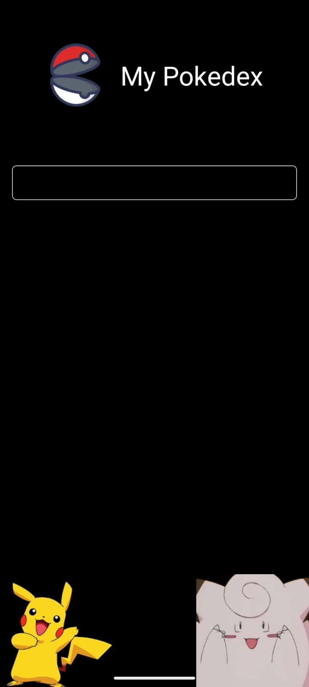
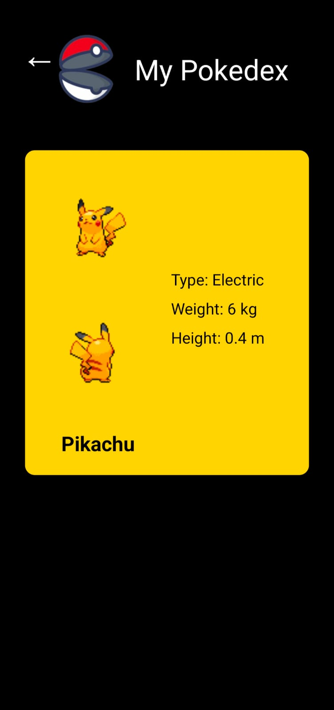
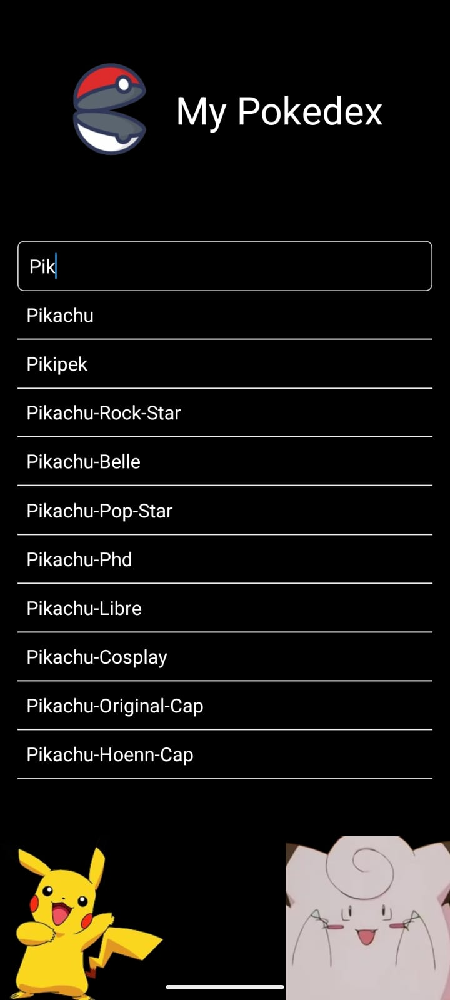

# My Pokedex App

This is a simple and elegant React Native app that allows users to search for any Pokémon and view key details such as their type, weight, height, and shiny forms. It uses the [PokeAPI](https://pokeapi.co/) to fetch live data.

---

## ✨ Features

- Autocomplete Pokémon search
- Fetches data from PokeAPI
- Displays shiny front & back images
- Shows type, height, weight
- Smooth navigation between screens

---

## 🚀 How it Works

The app consists of 3 main screens with clear navigation using `react-navigation`.

---

### 🏠 Main.js – Home Screen

- Displays a header with a Pokéball and app name.
- Shows a text input (via `PokemonAutoComplete`) to search any Pokémon.
- Two pointing arrow images appear at the bottom for design.
- On selection or typing a Pokémon name, it navigates to the `Pokemon.js` logic screen.

---

### 🔄 Pokemon.js – Data Fetch Logic

- Not a visible screen.
- Fetches Pokémon data from the API using the passed name.
- On success, navigates to `Description.js` with full data.
- On error (invalid Pokémon), alerts the user and returns to the main screen.

> ✅ You **won't see** this screen. It's just for backend logic.

---

### 🧾 Description.js – Pokémon Detail Screen

- Header shows Pokéball, "My Pokedex" text, and a back button (←).
- Shows shiny front & back sprites of the Pokémon.
- Displays the name, type (capitalized), weight (in kg), and height (in meters).

---

### 🔍 PokemonAutoComplete.js – Smart Search

- Fetches a list of all Pokémon names (over 1000) on app start.
- Filters suggestions as user types.
- Clicking a suggestion calls the `onSelect` handler to fetch data.

---

## 📁 Folder Structure

- App.js # Stack navigation setup
- Main.js # Home screen with autocomplete
- Description.js # Pokémon info display
- Pokemon.js # Logic for data fetching (not a screen UI)
- PokemonAutoComplete.js # Search and suggestion logic
- /components # Static assets like pokeball, pointing arrows
- /screenshots # Add screenshots here

---

## 🚀 API Used

- [PokéAPI](https://pokeapi.co/) — Free Pokémon REST API for data and images

---

## 🙌 That’s It!

This README explains your Pokédex screen-by-screen with a clean, focused overview.

